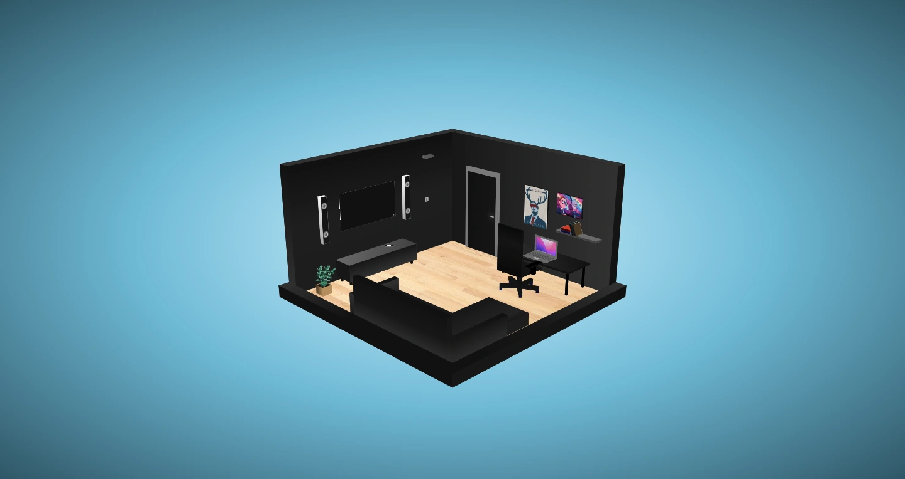
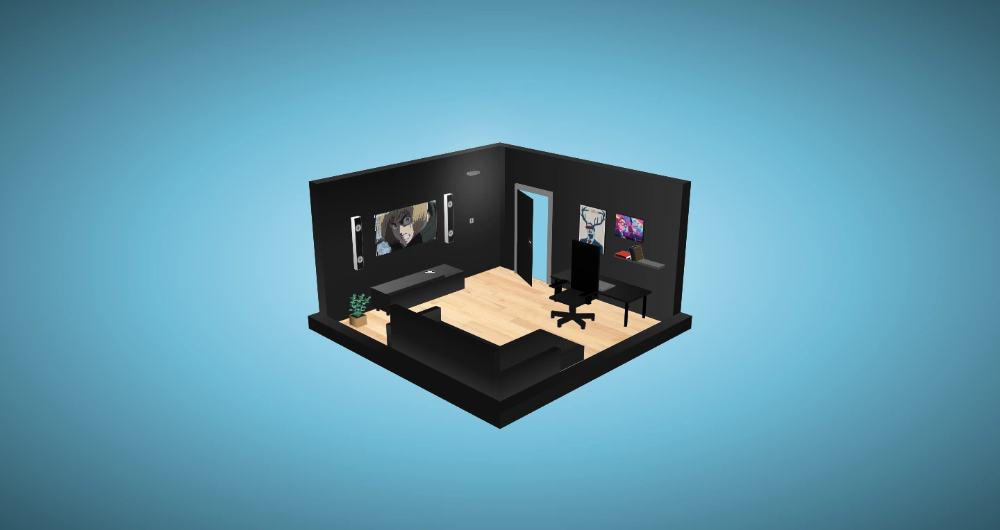

# 3D Room Model (not responsive)

This is a model of a 3D Room written with only CSS(SASS).

Explore the room for yourself... ;)

## Screenshots




## Get started

Install all modules and their dependencies that are listed on the package.json file:

```bash
npm install
```

Create the public folder and start the live-server: (save one of the SCSS files afterwards, to keep track of the changes and load the styles correctly)

```bash
npm start
```

## Built with

- HTML
- CSS(SASS)
- JS (only to play the music)
